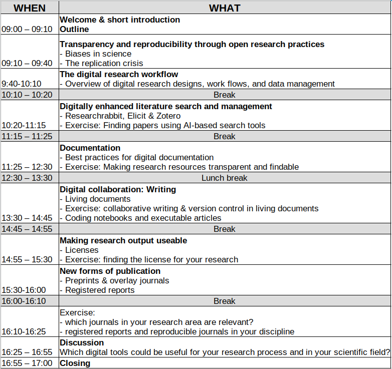

```{r xaringan-themer, include=FALSE, warning=FALSE}
# #This block contains the theme configuration for the CSS lab slides style
library(xaringanthemer) #
library(showtext)
style_mono_accent(
  base_color = "#1f5c99",
  text_font_size = "1.5rem",
  header_font_google = google_font("Raleway"),#("Yanone Kaffeesatz"),
  text_font_google   = google_font("Arial", "300", "300i"),
  code_font_google   = google_font("Fira Mono")
)
```

```{r setup, include=FALSE}
options(htmltools.dir.version = FALSE)
```

layout: true

<!-- --- -->
<!-- class: inverse, center, middle, title-slide -->
<!-- background-image: url(figures/title_slide.svg) -->
<!-- background-size: contain -->


<!-- --- -->
<!-- class: inverse, center, middle, title-slide -->

<!-- # Introduction & Overview -->


<!-- ### Dr. Jana Lasser (*CSH Vienna & Meduni Wien*) <br> Dr. Hannah Metzler  (*TU Graz & CSH Vienna*) -->

<!-- #### Folien: github.com/hannahmetzler/digital_tools_research -->

---
layout: true
<div class="my-footer"><span>
<a href ="www.github.com/hannahmetzler/digital_tools_research"> Folien: www.github.com/hannahmetzler/digital_tools_research  </a>
</span></div>

---

# Who are we?

**Dr. Jana Lasser** <br> <br>
RWTH Aachen & TU Graz <br>
Physics & Data Science  <br> <br>
www.janalasser.at    |    jana.lasser@tugraz.at    |    Twitter: @janalasser <br>

**Dr. Hannah Metzler**  <br> <br>
Complexity Science Hub & Meduni Vienna <br>
Psychology, Neuroscience & Data Science <br> <br>
www.hannahmetzler.eu    |    metzler@csh.ac.at    |    Twitter: @hannahmetzler1

???

## Digital tools throughout the research process

.pull-left[

* Whyd digital tools?
  * Reproducibility & transparency
  * Biases in science

* Overview: Digital research workflow

* Literatursuche & Management

]
    
.pull-right[
* Documentation

* Collaborations: Writing

* Licenses

* New forms of publication
]

???
Many exercises
Many tools - we hope there are some new and relevant ones for each of you

---
layout: true

---

```{r, echo=FALSE, out.width=680, fig.align='center'}

```

---

# Links

* [Time plan](https://cc.lbg.ac.at/wp-content/uploads/sites/23/2023/10/Syllabus_Digital-Tools_EN.pdf)

* Slides: [https://github.com/hannahmetzler/digital_tools_research/](https://github.com/hannahmetzler/digital_tools_research/)

```{r, echo=FALSE, out.width=300}

```

???
Questions whenever they arise

---

# Who are you?

* Scientific discipline

* More qualitative or quantitative research?

* Why were you interested in this skill training?

* Experience with Open Science practices? 
  * Repositories
  * Pre-registrations
  * Open Data & Code
  * Journals


