```{r xaringan-themer, include=FALSE, warning=FALSE}
# #This block contains the theme configuration for the CSS lab slides style
library(xaringanthemer) #
library(showtext)
style_mono_accent(
  base_color = "#1f5c99",
  text_font_size = "1.5rem",
  header_font_google = google_font("Raleway"),#("Yanone Kaffeesatz"),
  text_font_google   = google_font("Arial", "300", "300i"),
  code_font_google   = google_font("Fira Mono")
)
```

```{r setup, include=FALSE}
options(htmltools.dir.version = FALSE)
```
layout: true

---
# Overview

1. AI-powered & open source tools for finding papers

  * Paper recommendations & networks: [**ResearchRabbit**](https://researchrabbit.ai)

  * Finding specific articles or get an overview: [**Elicit**](www.elicit.com)

  * Exercise with ResearchRabbit or Elicit

3. (Collaborative) Management of literature & citations: [**Zotero**](www.zotero.org)

  * (Exercise)

---
name: researchrabbit

# [Smart literature search: ResearchRabbit](https://researchrabbitapp.com)

<br>
```{r, echo=FALSE, out.width=200, fig.align='center'}

```
<br> 

* ["Spotify" for papers](https://researchrabbitapp.com)

* Discover papers via recommendations based on articles you chose

* Visualize paper networks: topic, citations, references

* Collaboration networks: Discover research teams & their work

* Timelines, earlier & later work

---
background-image: url(figures/research_rabbit.svg)
background-size: contain
---
background-image: url(figures/research_rabbit_authors.png)
background-size: contain
---

## Other ResearchRabbit features
.pull-left[
Personalized alerts on new content

Comments/annotations

```{r, echo=FALSE, out.width=250}
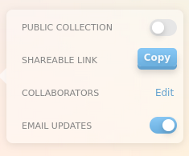
```
```{r, echo=FALSE, out.width=250}
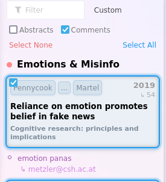
```
]
.pull-right[
Share collections

```{r, echo=FALSE, out.width=250}
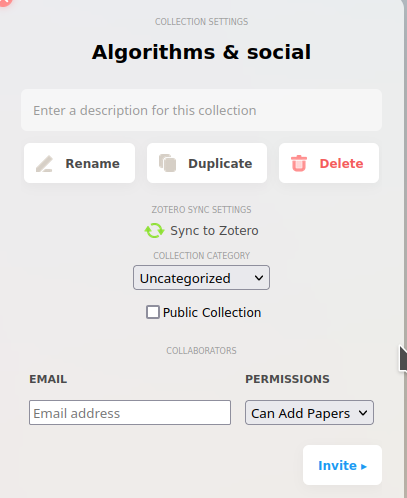
```
]
    
---
layout: true
name: elicit

---

# [Elicit: The AI research assistant](www.elicit.com)

```{r, echo=FALSE, out.width=500, fig.align='center'}
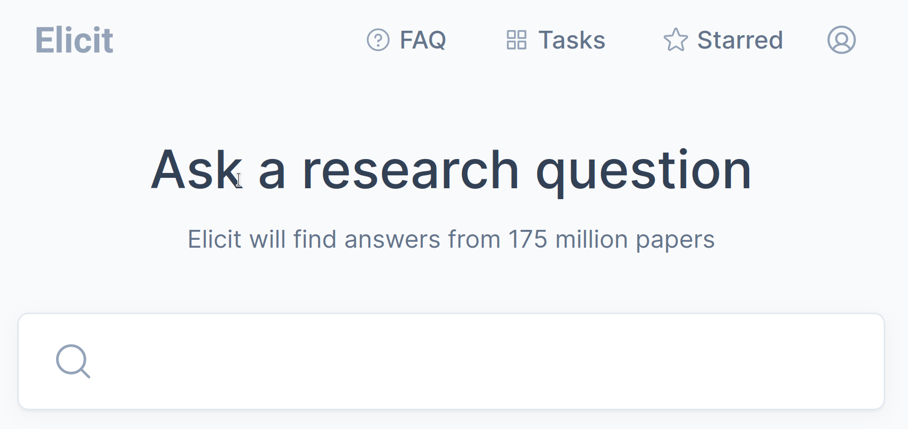
```

* Get an overview of many studies quickly

* Useful for reviews, meta-analyses

* Recently became subscription based (10$/month) :( but has free trial credits

---

.pull-left[
## Study features
```{r, echo=FALSE, out.width=250}
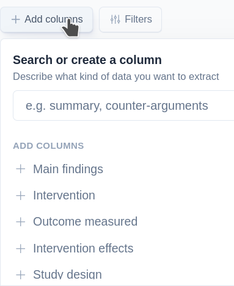
```
```{r, echo=FALSE, out.width=210}
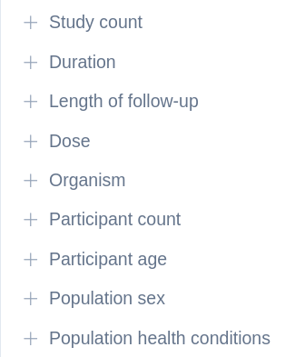
```
```{r, echo=FALSE, out.width=190, fig.align='center'}
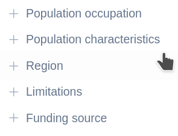
```

]
.pull-right[
## Filters
```{r, echo=FALSE, out.width=230}
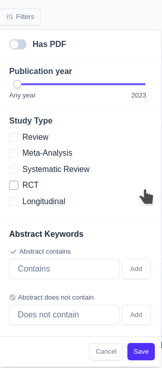
```
]
---
background-image: url(figures/elicit/paper_overview1.png)
background-size: contain
---
background-image: url(figures/elicit/paper_overview2.png)
background-size: contain
---
background-image: url(figures/elicit/custom_columns_and_link_to_text.png)
background-size: contain

## Custom columns and link to paper quotes
---
layout: true

---

##  Exercise: Using AI-enhanced search tools (15 min)

.pull-left[
### [ResearchRabbit](https://researchrabbit.ai)
* Create a collection 
* Add 1-5 papers (DOI/Title, ResearchRabbit's keyword search)
* Add a suggested paper to the collection
* Switch from Network to Timeline
* Display an author network
* Set an alert
* Add a comment to a paper
]

.pull-right[ 
### [Elicit](www.elicit.com)
  * Choose a research question
  * Delete an irrelevant paper
  * Select relevant study features
  * Select a filter (or use a keyword)
  * Add a custom-made column
  * Find the part of the paper describing the feature
]

---

# Managing literature - Zotero

* Store, organize and cite papers

* [https://www.zotero.org/](https://www.zotero.org/)

* Open source & flexible

.pull-left[
* Store PDFs in Zotero or with in folders (linked files)
* Online storage for access everywhere
* Organize: Collections & tags
]
.pull-right[
* Automatic citations & bibliographies
* Group libraries for sharing literature
* Marking PDFs & automatic notes
]

---
background-image: url(figures/zotero_overview.svg)
background-size: contain
---

## Getting papers into (and out of) your library

.pull-left[
* Via the browser extension:  
```{r, echo=FALSE, out.width=300}
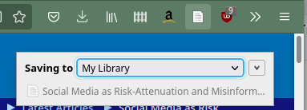
```
<br><br>
* Pull PDFs into Zotero
  * Automatic meta-data & renaming
]

.pull-right[
* With item identifier (ISBN, DOI): 
```{r, echo=FALSE, out.width=400}
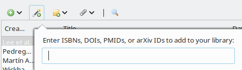
```

* Papers get added into currently active collection
]
* Most scientific databases automatically add keywords as tags

* Move/send: Drag-&-drop PDFs to email/folder (or item entry to email/text file)

---

## Organizing with collections & tags

* Collections: each item can be in several collections
* Press Alt to find collection of item &ensp;
```{r, echo=FALSE, out.width=450}
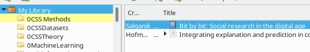
```

```{r, echo=FALSE, out.width=850}
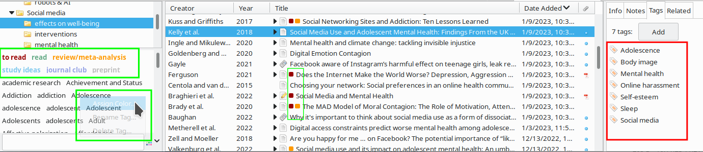
```
&ensp;
```{r, echo=FALSE, out.width=180}
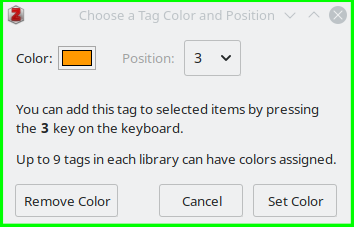
```
* Assign colour tags & keyboard shortcut (keys 1-9): right click
* Multiple items at once: Draw them onto tag (bottom left)
* Searching papers: combine tag search+selection with keyword search
---

## Notes & Annotating PDFs

```{r, echo=FALSE, out.width=1000}
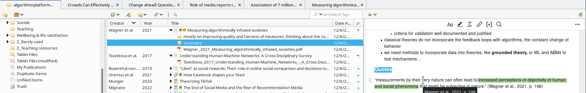
```

```{r, echo=FALSE, out.width=900}
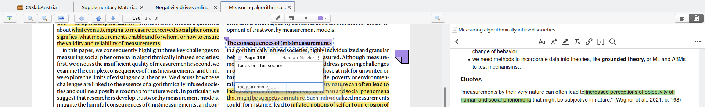
```

* Automatic summary notes: Right click on PDF
```{r, echo=FALSE, out.width=180}
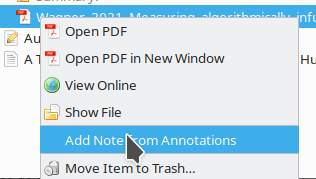
```

---
layout: true
<div class = "my-footer"><span>
<a href="https://www.zotero.org/support/sync#alternative_syncing_solutions">Zotero syncing solutions</a>
</span></div>

---


## Group libraries for collaborations

* Invite other users to group on [zotero.org](https://www.zotero.org/groups)
* In Zotero

```{r, echo=FALSE, out.width=200}
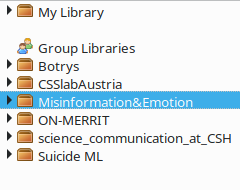
```
* Make collections available online

  * private or public
  * read or edit access
  * for sharing literature lists/PDFs or discover sources of others
  
---

## Syncing library data & files

.pull-left[
* Library data for free
* Files (PDFs etc) are stored locally
* New PC: copy Zotero folder <br><br>
* Online storage on Zotero servers: 
```{r, echo=FALSE, out.width=250}
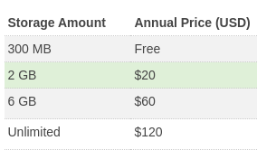
```
* Zotfile Add-on: Link to files in cloud (Dropbox, Google Drive...)
]

.pull-right[.center-right[
```{r, echo=FALSE, out.width=350}
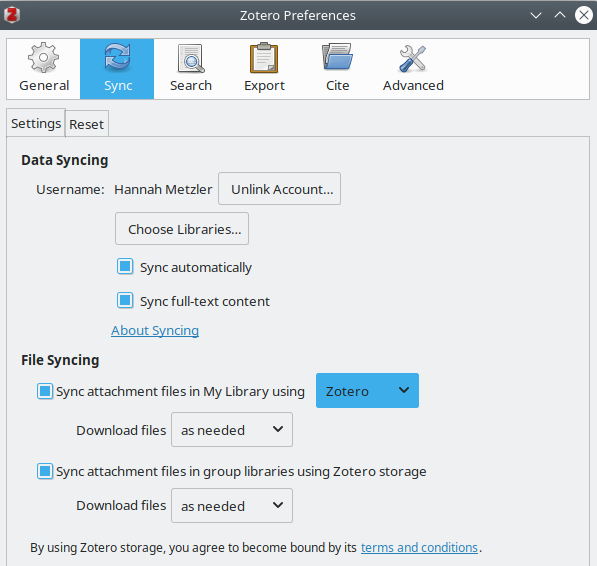
```
<br<br>
```{r, echo=FALSE, out.width=260}

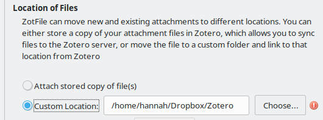
```
]]

???
## Search and saved searches

* Quick search: 
  * speed it up by starting with " in large collections

```{r, echo=FALSE, out.width=250, fig.align='center'}
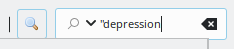
```

.pull-left[
* Advanced search: 
    * can be saved
    * constantly updating collection
]
.pull-right[
```{r, echo=FALSE, out.width=550, fig.align='right'}
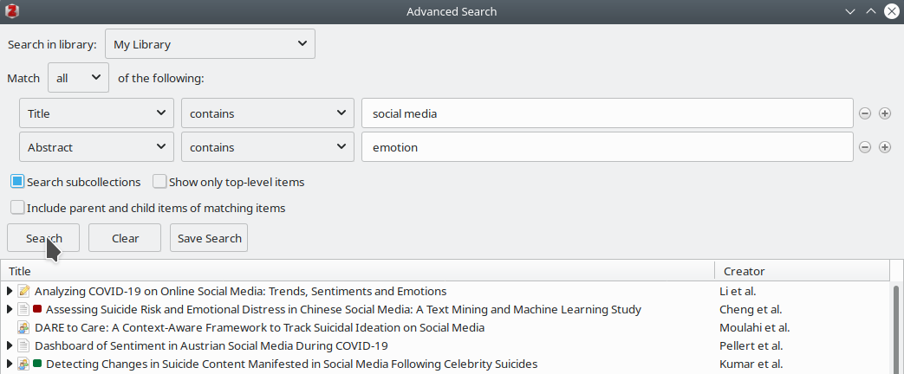
```
]
---
layout: true

---

## Citations

.pull-left[.center-left[
* Add-ins for Word, Libre Office, Google Docs are included
```{r, echo=FALSE, out.width=350}
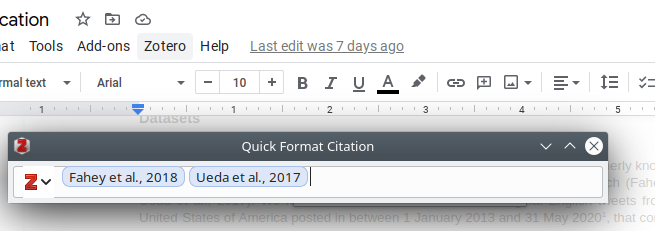
```
```{r, echo=FALSE, out.width=210}
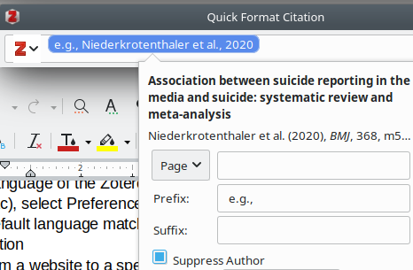
```

* Overleaf/Latex: Export BibTex citations (automate with Better BibTex Add-on)
]]
.pull-right[.center-right[
Automated bibliography: 
```{r, echo=FALSE, out.width=600}
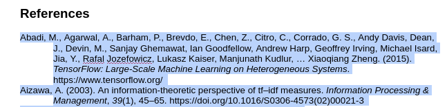
```
```{r, echo=FALSE, out.width=300, fig.align='center'}
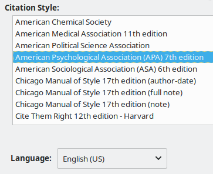
```

Quickly switch between citation styles
]]

---

## Zotero: More resources 

* [Documentation](https://www.zotero.org/support/start)

* [Quick start guide](https://www.zotero.org/support/quick_start_guide)

* [12 must know Zotero tips and techniques](
http://ideophone.org/12-zotero-tips-and-techniques)

* [Numerous other Add-ons](https://www.zotero.org/support/plugins)

---
class: title-slide, middle, center

# Optional exercises

---

## Zotero exercises (15 min)

.pull-left[
* Add a paper to a collection: 
  * via plugin on publisher website
  * by pulling in a PDF
  * via DOI
  
* Add keywords in "Tags"
* Create a color tag "to read" in red 

* Select multiple tags

* Link item to a related article
]

.pull-right[
* Open a PDF within Zotero, mark important sentences/keywords, then add extract notes from annotations
* In a Google or Word doc
  * Add a few citations, with/wo author
  * Create a reference list
  
* For [Obsidian](https://obsidian.md/) users: check out step 10-15 in this [tutorial](https://twitter.com/rdpalacio/status/1601641098535129088)
]

---
name: workflow
layout: true
<div class="my-footer"><span>
<a href = "https://twitter.com/rdpalacio/status/1601640985858957312"> Workflow: Ruben Dario on Twitter </a>
</span></div>

---

## Exercise: Literature search workflow (15 min)

.right-column[.center-right[
1. Find highly cited articles with Google Scholar (or specific articles with [Elicit](www.elicit.com))
2. Open on publisher website & import to [Zotero](www.zotero.org) collection
3. Sync the collection with [ResearchRabbit](www.researchrabbit.ai)
4. Explore recommendations via ResearchRabbit
5. Add papers to Zotero collection via ResearchRabbit

```{r, echo=FALSE, out.width=750}
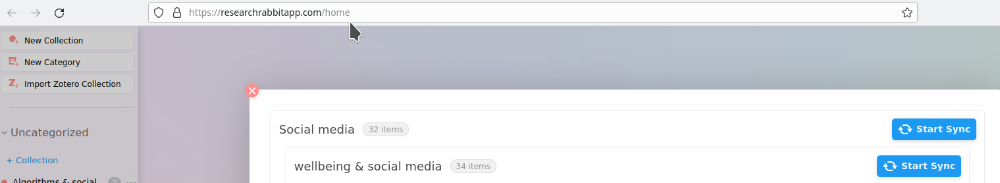
```
]]

.left-column[
#### Workflow
```{r, echo=FALSE, out.width=200}
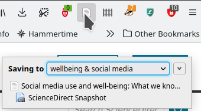
```
]

???
30 min total for the presentation (without exercises)
11 min for ResearchRabbit & Elicit
19 for Zotero